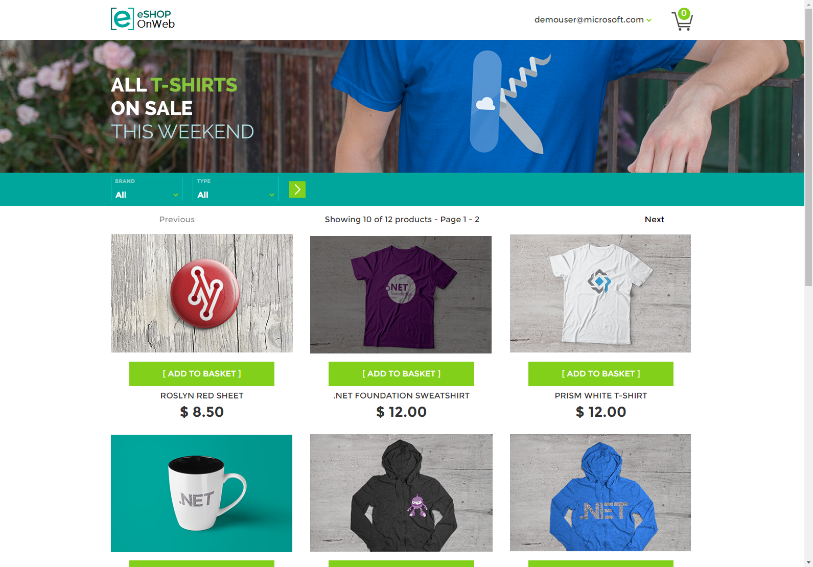

# Microsoft eShopOnWeb ASP.NET Core Application E2E

- [Project Description](#project-description)
- [Services used in the project](#services-used-in-the-project)
- [Build the Docker Image](#build-the-docker-image)
- [Local Development using Docker Compose](#local-development-using-docker-compose)
- [E2E walk-through: CI/CD (Jenkins)](#e2e-walk-through-cicd-jenkins)
  - [CI Structure](#ci-structure)
  - [CD Structure](#cd-structure)
- [Infrastructure Provisioning and Configuration Management](#infrastructure-provisioning-and-configuration-management)
- [To-Do](#to-do)

##  <a name='ProjectDescription'></a>Project Description
The Project is a Sample ASP.NET Core 8.0 reference application, powered by Microsoft. I have decided to create the full cycle of DevOps CI/CD Life Cycle and I will go and describe what I'm doing in each phase so let's start.



##   <a name='Servicesusedintheproject'></a>Services used in the project
- **Github** – source code and version control 
- **Docker** – containerization the ASP.NET Core web app
- **Docker Compose** – local development with app and SQL Server
- **Jenkins** – CI/CD pipeline automation (build, test, deploy)
- **SqlServer** – database for the app
- **AWS EC2 / VPC / Security Groups / etc** – cloud infrastructure components provisioned via Terraform
- **Terraform** – infrastructure as code (IaC) for AWS resources provisioning
- **Ansible** – configuration management and automated deployment to provisioned servers

##   <a name='build-the-docker-image'></a>Build the Docker Image
- To build the Docker image for the **eShopOnWeb** ASP.NET Core 8.0 application, run the following command from the **root directory** of the project (where `eShopOnWeb.sln` is located):
```bash
docker build -f docker/Dockerfile -t eshoponweb-app .
```
- -f docker/Dockerfile points to the Dockerfile located inside the docker/ folder.
- -t eshoponweb-app assigns a name (tag) to the built image.
- . is the build context, which includes the whole project files
- Once built successfully, the image eshoponweb-app will be available locally and ready to run using Docker or Docker Compose.
You can Check up the link for the Docker file [Here](https://github.com/AiOpsVision/eShopOnWeb/blob/main/docker/Dockerfile)

##  Local Development using Docker Compose

- You can run the entire application stack (web app + SQL Server) locally using Docker Compose. This provides a fast and consistent environment for development and testing.
- You can Check   up the link for the Docker Compose [Here](https://github.com/AiOpsVision/eShopOnWeb/blob/main/docker-compose.yml)

 ### Prerequisites

- Docker & Docker Compose installed
- Port `5000` (for app) and `1433` (for SQL Server) available on your host machine

 ### Run the Application

From the project root, run:

```bash
docker-compose up -d
```
This command will:

- Build and start the eshoponweb-app container using the provided Dockerfile
- Start a Microsoft SQL Server container with the correct configuration
- Link the web app to the database via internal networking

### Access the App
Once the containers are running, open your browser and navigate to: http://localhost:5000
The app should now be accessible and connected to the local SQL Server instance.

### Stop the Environment
To stop and remove the running containers:
```bash
docker-compose down
```
Make sure to review docker-compose.yml if you want to customize ports, volumes, or environment variables


## E2E walk-through: CI/CD (Jenkins)

This project includes a fully automated CI/CD pipeline powered by **Jenkins**, containerized using Docker for easy setup and reproducibility.

### Run Jenkins in Docker

From project root, start the Jenkins environment using Docker Compose:

```bash
docker-compose -f docker-compose.jenkins.yml up -d
```
Jenkins will be available at: http://localhost:8080

You can Check   up the link for the Docker Compose for jenkins [Here](https://github.com/AiOpsVision/eShopOnWeb/blob/main/docker-compose.jenkins.yml)

Initial Access: To retrieve the admin password for first-time login:

```bash
docker exec -it jenkins cat /var/jenkins_home/secrets/initialAdminPassword
```
Follow the setup wizard to install recommended plugins and create your admin user.

**Note:** I completely disabled the Setup Wizard phase(plugins and creating users) and used file of plugins and users i created by Realm for logging on

## CI Structure
The CI pipeline is defined using a declarative jenkins.yaml file (Pipeline as Code) and consists of the following stages:

- Restore Dependencies – restore NuGet packages
- Build Application – compile the application
- Run Tests – run unit tests
- Publish Artifacts – publish build artifacts
- Docker Login & Build Docker Image & Push to Docker Hub  – build the Docker image and push it to a registry.

You can Check up the link for the Jenkinsfile-CI [Here](https://github.com/AiOpsVision/eShopOnWeb/blob/main/Jenkinsfile-CI)


## CD Structure
The stages of this pipeline:

- Terraform Apply – provision infrastructure
- Run Ansible Playbook – configure and deploy the app to provisioned servers

You can Check up the link for the Jenkinsfile-CD [Here](https://github.com/AiOpsVision/eShopOnWeb/blob/main/Jenkinsfile-CD)


## Infrastructure Provisioning and Configuration Management 

The infrastructure for this project is provisioned using **Terraform** and deployed to **AWS**. This includes VPCs, subnets, EC2 instances, security groups, etc.After provisioning the infrastructure, **Ansible** is used to configure the EC2 instances and deploy the eShopOnWeb application.

You can Check up the link for the terraform folder [Here](https://github.com/AiOpsVision/eShopOnWeb/tree/main/infra/terraform)

You can Check up the link for the ansible folder [Here](https://github.com/AiOpsVision/eShopOnWeb/tree/main/infra/ansible)

## To-Do
- Migrate Docker-based deployment to **Kubernetes** for production-grade orchestration, scalability, and self-healing.
